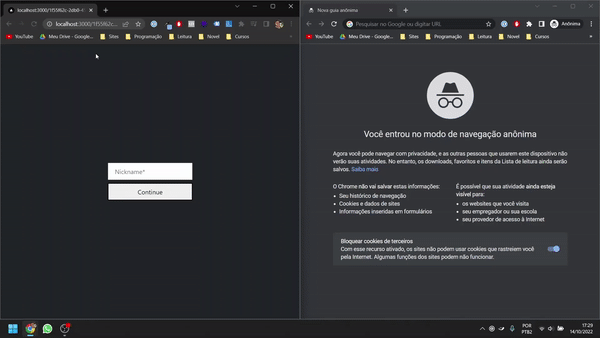

# Aplicação Next.js 

&nbsp;

### Para Iniciar a aplicação insira o seguinte código no terminal dentro da pasta

&nbsp;

```bash
npm run dev
# or
yarn dev
```

&nbsp;



&nbsp;

Basta você entrar em http://localhost:3000 que ele te levará automaticamente para uma sala de conversa. Coloque o nickname que irá aparecer quando você escrever algo.

Pegue o link da sala na URL e entre na guia anônima com esse link, coloque novamente o nickname e pronto! Basta conversar que você verá o chat em tempo real acontecer, lembrando que é possível várias pessoas participarem na mesma sala :)

## Pontos que quero adicionar:

[ - ] Botão para copiar o link automáticamente para a área de transferência.

[ - ] Vincular essa aplicação a um banco de dados, que irá gerir os usuários e guardar as mesagens da sala caso alguém entre depois, ele terá acesso as mensagens antigas.